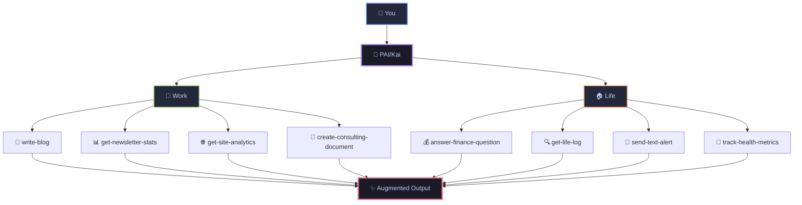
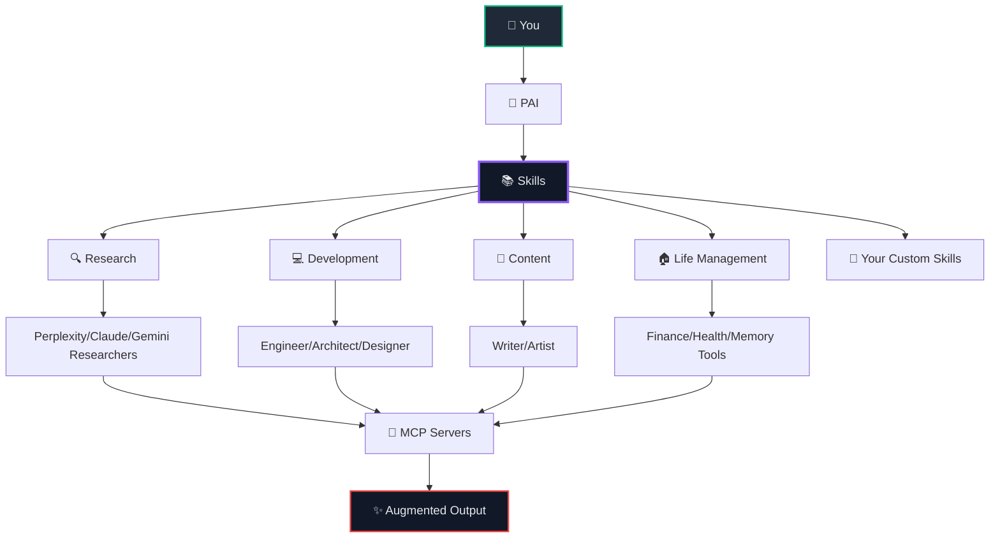

<div align="center">

<picture>
  <source media="(prefers-color-scheme: dark)" srcset="./pai-logo.png">
  <source media="(prefers-color-scheme: light)" srcset="./pai-logo.png">
  
</picture>

# **Personal AI Infrastructure** (PAI)

### **Open-source personal AI infrastructure for orchestrating your life and work**

> **🤖 Bob Fork**: This is a personal fork of PAI customized for Wally's WSL2 environment. See [BOB_SETUP.md](./BOB_SETUP.md) for fork-specific setup. Upstream: [danielmiessler/Personal_AI_Infrastructure](https://github.com/danielmiessler/Personal_AI_Infrastructure)

<br/>


[](https://opensource.org/licenses/MIT)
[](https://claude.ai/code)
[](https://youtu.be/iKwRWwabkEc)


**[Features](#-key-features)** • **[Quick Start](#-quick-start)** • **[Documentation](#-documentation)** • **[Examples](#-examples)** • **[Community](#-community)**

</div>

---

## 🚀 **Recent Updates**

> [!TIP]
> **✨ October 19** Now using the session-start hook to load our PAI skill on system load! Great bootloader for the overall Skills system! This is a better version of what we were doing before with UFC but now utilizing the skills system.

> **✨ October 18** Overall just massive updates to the PAI repo. Fixed tons of missing files, hooks, settings, etc. Thank you all for submitting issues and PRs!

> **✨ v0.5.0 NEW:** Skills-based PAI architecture with 92.5% token reduction! Core identity now in skill description, zero hook overhead. [See details below →](#-recent-updates)


<details>
<summary><strong>📅 2025-10-20 - Automated Documentation Update</strong></summary>

- **Settings:** 1 updated

*Updated by pre-commit hook: 1 modified*

</details>


<details>
<summary><strong>📅 2025-10-19 - Automated Documentation Update</strong></summary>

- **Voice:** 2 updated

*Updated by pre-commit hook: 3 modified*

</details>


<details>
<summary><strong>📅 2025-10-19 - Automated Documentation Update</strong></summary>

- **Skills:** 1 updated, 5 removed

*Updated by pre-commit hook: 1 modified, 5 deleted*

</details>


<details>
<summary><strong>📅 2025-10-19 - Automated Documentation Update</strong></summary>

- **Settings:** 1 updated

*Updated by pre-commit hook: 1 modified*

</details>


<details>
<summary><strong>📅 2025-10-19 - Automated Documentation Update</strong></summary>

- **Settings:** 1 updated

*Updated by pre-commit hook: 1 modified*

</details>


<details>
<summary><strong>📅 2025-10-19 - Automated Documentation Update</strong></summary>

- **Settings:** 1 removed

*Updated by pre-commit hook: 1 deleted*

</details>


<details>
<summary><strong>📅 2025-10-19 - Automated Documentation Update</strong></summary>

- **Hooks:** 2 new, 1 removed
- **Settings:** 1 updated

*Updated by pre-commit hook: 3 added, 1 modified, 1 deleted*

</details>


<details>
<summary><strong>📅 2025-10-19 - Automated Documentation Update</strong></summary>

- **Skills:** 1 new

*Updated by pre-commit hook: 1 added*

</details>


<details>
<summary><strong>📅 2025-10-19 - Automated Documentation Update</strong></summary>

- **Skills:** 1 new

*Updated by pre-commit hook: 1 added*

</details>


<details>
<summary><strong>📅 2025-10-19 - Automated Documentation Update</strong></summary>

- **Agents:** 3 updated
- **Commands:** 1 updated

*Updated by pre-commit hook: 5 modified*

</details>

<details>
<summary><strong>Click to see all updates</strong></summary>

<details>
<summary><strong>📅 v0.5.0 - Skills-Based PAI Architecture (92.5% Token Reduction)</strong></summary>

**Major Architectural Improvement:**
- **Zero hook overhead** - Eliminated all context loading from UserPromptSubmit hook
- **92.5% token reduction** - From 4000 tokens/interaction to 300 tokens
- **Pure skills architecture** - Core identity in skill description (always in system prompt)
- **On-demand context** - Full context loaded only when explicitly needed

**What Changed:**
- Added YAML frontmatter to `skills/PAI/SKILL.md` with comprehensive system description
- Core identity + critical security now in skill description (always present)
- Removed `MINIMAL.md` entirely (no longer needed)
- Hook renamed to `update-tab-titles.ts` (only handles tab titles, zero context)
- Flat file structure in `skills/PAI/` (no `/contexts` subdirectory)

**Architecture:**
- **Tier 1 (Always On):** Skill description in system prompt (~300 tokens) - identity, critical security, architecture explanation
- **Tier 2 (On Demand):** `SKILL.md` body loaded when PAI skill invoked (~4000 tokens) - contacts, preferences, voice IDs, detailed security
- **Hook:** Only updates tab titles (0 tokens context overhead)

**Benefits:**
- Cleanest possible architecture - fully embraces Claude Code skills system
- Context always relevant - skill description always present, full context on-demand
- Easy to customize - clear YAML frontmatter with `[CUSTOMIZE:]` markers
- Scales efficiently - adding content doesn't multiply token costs

**Files:**
- `skills/PAI/SKILL.md` - Full context with YAML frontmatter
- `skills/PAI/contacts.md` - Contact templates
- `skills/PAI/preferences.md` - Stack preferences templates
- `skills/PAI/response-format.md` - Response format templates
- `skills/PAI/security-detailed.md` - Security procedures
- `skills/PAI/voice-ids.md` - Voice system configuration (optional)
- `hooks/update-tab-titles.ts` - Tab title updates only

</details>

<details>
<summary><strong>📅 v0.4.0 - Repository Restructure 🔥 BREAKING CHANGE</strong></summary>

**⚠️ Breaking Changes:**
- PAI_DIR environment variable: Change from `/path/to/PAI/PAI_DIRECTORY` to `/path/to/PAI`
- Repository renamed: `PAI` → `Personal_AI_Infrastructure`

**What Changed:**
- Moved all `PAI_DIRECTORY/` contents to repository root (agents/, skills/, commands/, etc.)
- Repository renamed for clarity and better SEO
- All functional directories now immediately visible on GitHub
- GitHub automatically redirects old URLs to new

**Migration:**
1. Update PAI_DIR: `export PAI_DIR="/path/to/PAI"` (remove `/PAI_DIRECTORY`)
2. Reload shell: `source ~/.zshrc`
3. Pull latest: `git pull`
4. Update remote: `git remote set-url origin git@github.com:danielmiessler/Personal_AI_Infrastructure.git`

</details>

<details>
<summary><strong>📅 v0.3.2 - Fabric Skill with Intelligent Pattern Selection</strong></summary>

Fabric skill now intelligently selects the right pattern from 242+ options based on user intent. Complete Fabric repository bundled locally. Categories: Security (15), Summarization (20), Extraction (30+), Analysis (35+), Creation (50+), Improvement (10), Rating (8).

</details>

<details>
<summary><strong>📅 v0.3.1 - Research Skills & API Key Infrastructure</strong></summary>

Multi-source research with parallel agent execution. New skills: `alex-hormozi-pitch`, `research`. New agents: `perplexity-researcher`, `claude-researcher`, `gemini-researcher`. Added `.env.example` with API key documentation.

</details>

<details>
<summary><strong>📅 v0.3.0 - Skills System Migration</strong></summary>

Migrated to [Anthropic's Skills architecture](https://www.anthropic.com/news/skills). Modular skill packages with progressive disclosure. Context system → Skills system. See [documentation](./documentation/skills-system.md) for details.

</details>

<details>
<summary><strong>📅 v0.2.4 - README Cleanup</strong></summary>

Collapsed updates section, reduced visual clutter, optimized space.

</details>

<details>
<summary><strong>📅 v0.2.3 - Visibility & Portability</strong></summary>

`.claude` → `PAI_DIRECTORY`, vendor agnostic, dynamic paths with `${PAI_DIR}`, full portability.

</details>

<details>
<summary><strong>📅 v0.2.2 - Voice System</strong></summary>

Migrated to macOS native Premium voices (zero cost, offline, private).

</details>

<details>
<summary><strong>📅 v0.2.0 - v0.1.0 - Initial Releases</strong></summary>

Public release with voice server, PAI_HOME support, comprehensive documentation, MCP detection, hooks system.

</details>

<details>
<summary><strong>📅 Previous Updates</strong></summary>

**September 20, 2025**
- 🗣️ Added `/voice-server` with ElevenLabs integration
- 🔧 Fixed hardcoded path issues
- 🪝 Working on missing hooks

**September 12, 2025**
- 🧠 Dynamic resource loading system
- ⚡ Submit-user-hook for context loading
- 🗺️ Dynamic routing via load-dynamic-requirements

</details>

</details>

---

## 🎯 **What is PAI?**

> **Core Mission:** Augment humans with AI capabilities so they can survive and thrive in a world full of AI.

## 🌍 **The Problem**

<div align="center">

> ### It doesn't matter how powerful AI becomes if it's not accessible to everyone

</div>

Right now, AI is trapped behind corporate APIs, expensive subscriptions, and complex interfaces that only developers can use. Meanwhile, billions of people who could benefit from AI augmentation—artists, teachers, small business owners, researchers, parents—are left behind.

PAI exists to solve this. This project's goal is to give the most powerful AI capabilities, in the form of a complete platform, to everyone on Earth. Not just the tech elite. Not just the wealthy. Everyone.

<div align="center">



</div>

**PAI is an open-source, full personal AI platform that's completely agnostic to who you are and what you're trying to accomplish.**

Think of PAI as your personal AI that actually knows you—all your projects, your style, your data—and can handle anything you throw at it. Whether you're an artist transitioning to independence, a founder building a company, or someone managing complex health needs, PAI becomes whatever you need it to be.

PAI is part of the journey toward Human 3.0—where humans are augmented by AI to amplify their capabilities.

📖 **[Learn how PAI fits into the Human 3.0 vision](https://danielmiessler.com/blog/how-my-projects-fit-together)**

<table>
<tr>
<td width="33%" valign="top">

### 🧠 **Life Management**

**Finance Intelligence**
- `answer-finance-question` - Analyze bank statements
- `get-finances-state` - Track spending patterns
- Parse PDFs for utility bills and expenses

**Memory & Conversations**
- `get-life-log` - Search recorded meetings
- Query Limitless.ai pendant recordings
- Find what was discussed at any event

**Health Tracking**
- Monitor wellness metrics
- Track medical records
- Analyze sleep and fitness data

</td>
<td width="33%" valign="top">

### 💼 **Professional**

**Content Creation**
- `write-blog` - Generate posts in your style
- `publish-blog` - Deploy to production
- `enhance-content` - Improve existing work

**Business Analytics**
- `get-newsletter-stats` - Beehiiv metrics
- `get-site-analytics` - Website performance
- `create-consulting-document` - Client deliverables

**Development**
- `design-review` - Code analysis
- `browser-tools-setup` - Automation
- `update-daemon` - API management

</td>
<td width="33%" valign="top">

### 🎯 **Personal Growth**

**Knowledge Capture**
- `extract-knowledge` - Learn from content
- `capture-learning` - Document insights
- `web-research` - Deep investigations

**Communication**
- `send-email` - Automated outreach
- `send-text-alert` - SMS notifications
- `send-discord-alert` - Team updates

**Productivity**
- `add-linear-ticket` - Task management
- `create-mermaid-visualization` - Idea mapping
- `query-context` - Access any stored knowledge

</td>
</tr>
</table>

### 🌟 **Why This System is Different**

> *This system is designed from the very beginning to be available to anybody and to grow and scale with you throughout your life.*

- **🔓 Open Framework**: No vendor lock-in, complete transparency, you own everything
- **🌍 Universal**: Works for anyone, anywhere, in any profession or life situation
- **🤖 Platform Independent**: Core structure works with Claude, GPT, Gemini, or any AI platform
- **🧠 Persistent Memory**: Your AI remembers every context, project, and conversation
- **🎯 Task Agnostic**: From writing a blog to tracking medical data to running a business
- **📁 Plain Text**: All configuration in human-readable files you can edit and understand
- **🔌 Extensible**: Add your own commands, agents, and integrations

📖 **[Read the full technical deep-dive on PAI](https://danielmiessler.com/blog/personal-ai-infrastructure)**

---

## ⚡ **Architecture**

### 🏗️ **The PAI System Architecture**



**Skills are the core organizational unit.** Everything in PAI is built around modular skills that activate based on your intent.

### 📚 **Skills System**

<table>
<tr>
<td width="50%">

```
${PAI_DIR}/skills/
├── prompting/           # Prompt engineering standards
├── create-skill/        # Skill creation framework
├── ffuf/                # Web fuzzing for pentesting (by @rez0)
├── alex-hormozi-pitch/  # $100M Offers pitch framework
├── research/            # Multi-source research (requires API keys)
├── fabric/              # Intelligent Fabric pattern selection (242+ patterns)
├── web-scraping/        # Web data extraction
├── chrome-devtools/     # Browser automation
├── youtube-extraction/  # YouTube transcript extraction
├── ref-documentation/   # Technical docs search
├── webapp-testing/      # Playwright testing patterns
└── [your-custom-skills]/
```

</td>
<td width="50%">

**Features:**
- ✅ Modular capability packages
- 📄 Progressive disclosure (SKILL.md → CLAUDE.md)
- ⚡ Intent-based activation
- 📂 Self-contained with templates
- 🔌 Inherits global context

</td>
</tr>
</table>

### 🎯 **How Skills Work**

**Skills activate automatically based on your intent:**

- **Say:** "Research the latest AI developments"
  **→** `research` skill loads → Launches parallel Perplexity/Claude/Gemini researchers

- **Say:** "Build a task tracker app"
  **→** `development` skill loads → Invokes architect and engineer agents

- **Say:** "Create a threat model"
  **→** `fabric` skill loads → Selects `create_threat_model` pattern from 242+ options

**Each skill contains:**
- 📄 Intent triggers ("USE WHEN...")
- 🤖 Specialized agents (if needed)
- 🔌 MCP integrations (if needed)
- ⚡ Commands and tools (if needed)
- 📖 Documentation and examples

> [!TIP]
> **You don't manage agents or commands directly.** Just tell PAI what you want to do, and the right skill activates with all necessary resources.

### 💡 **Example Skills (Included)**

| Skill | What It Does | Example Usage |
|:------|:-------------|:--------------|
| **🔍 research** | Multi-source research with parallel agents | "Research quantum computing trends" |
| **🧵 fabric** | 242+ AI patterns (threat modeling, summarization, extraction) | "Create a threat model for our API" |
| **💻 development** | Full-stack development with architect and engineer agents | "Build a meditation timer app" |
| **🎨 design** | UX/UI design with shadcn/ui and Figma integration | "Design a dashboard for analytics" |
| **🔒 ffuf** | Web fuzzing for penetration testing | "Test this API for vulnerabilities" |
| **📊 alex-hormozi-pitch** | Create irresistible offers using $100M Offers framework | "Create a pitch for my SaaS product" |
| **🌐 web-scraping** | Extract data from websites (BrightData + Apify) | "Scrape product listings from this site" |
| **📖 ref-documentation** | Search technical docs (React, Next.js, 100+ frameworks) | "How do I use React hooks?" |
| **▶️ youtube-extraction** | Extract transcripts and content from YouTube videos | "Summarize this YouTube video" |
| **🎭 webapp-testing** | Browser automation and visual testing | "Test the login flow" |

**Skills use MCP servers for integrations:**
Chrome DevTools • Apify • BrightData • Stripe • Anthropic Content • Daemon (your data) • And more...

---

## 🚀 **Quick Start**

**Automated Setup:**
```bash
./setup.sh  # Interactive setup script (recommended)
```

**Or read:** [Getting Started Guide](./documentation/how-to-start.md) | [Quick Reference](./documentation/QUICK-REFERENCE.md)

> [!NOTE]
> PAI was originally built with [Claude Code](https://claude.ai/code), but the architecture supports any AI platform (GPT, Gemini, etc.)
> Requires [Bun](https://bun.sh) JavaScript runtime for the current implementation.

### **Manual Installation**

#### **Step 1: Install Prerequisites**

```bash
# Install Bun (JavaScript runtime)
brew install oven-sh/bun/bun 

# Get Claude Code (AI interface)
# Visit: https://claude.ai/code
```

#### **Step 2: Clone PAI Repository**

```bash
# Clone the PAI repository
git clone https://github.com/danielmiessler/Personal_AI_Infrastructure.git
cd Personal_AI_Infrastructure

# All functional directories are now visible at root
ls -la  # See agents/, skills/, commands/, etc.
```

#### **Step 3: Configure PAI Directory Variable** ⚠️ **IMPORTANT**

> [!IMPORTANT]
> **You MUST configure the PAI_DIR variable to point to your PAI installation directory.**
> This makes the PAI system completely agnostic to your installation location.

```bash
# Add to your shell config (~/.zshrc or ~/.bashrc)
# Replace /path/to/PAI with YOUR actual PAI installation path
export PAI_DIR="/path/to/PAI"  # Point to the PAI repository root
export PAI_HOME="$HOME"  # Your home directory

# Example (adjust to YOUR installation path):
# export PAI_DIR="$HOME/Projects/PAI"
# export PAI_DIR="$HOME/Documents/PAI"
# export PAI_DIR="/Users/yourname/PAI"

# Reload your shell configuration
source ~/.zshrc  # or source ~/.bashrc
```

#### **Step 4: Configure Environment & API Keys**

```bash
# Copy environment template
cp ${PAI_DIR}/.env.example ${PAI_DIR}/.env

# Configure your API keys
vim ${PAI_DIR}/.env
```

> [!IMPORTANT]
> **Some skills and agents require API keys to function:**
>
> **Required for Research Agents:**
> - `PERPLEXITY_API_KEY` - For perplexity-researcher agent ([Get key](https://www.perplexity.ai/settings/api))
> - `GOOGLE_API_KEY` - For gemini-researcher agent ([Get key](https://aistudio.google.com/app/apikey))
> - Claude WebSearch is built-in (no key needed for claude-researcher)
>
> **Optional for AI Generation:**
> - `REPLICATE_API_TOKEN` - For AI image/video generation ([Get key](https://replicate.com/account/api-tokens))
> - `OPENAI_API_KEY` - For GPT integration and Sora billing ([Get key](https://platform.openai.com/api-keys))
>
> See `.env.example` for complete list and setup instructions.
> **NEVER commit your `.env` file to version control!**

#### **Step 5: Launch PAI**

```bash
# Navigate to PAI directory
cd ${PAI_DIR}

# Optional: Set up voice notifications (macOS only)
# Download Premium/Enhanced voices from System Settings → Voice (Live Speech)
# Then start the voice server:
cd voice-server && bun server.ts &
# See documentation/VOICE-SETUP-GUIDE.md for detailed setup instructions

# Open Claude Code and start using PAI!
# Your personal AI infrastructure is ready 🚀
```

### **⚙️ Environment Variables**

```bash
# ============ REQUIRED CONFIGURATION ============
PAI_DIR="/path/to/PAI"                  # PAI repository root (system agnostic)
PAI_HOME="$HOME"                        # Your home directory

# ============ RESEARCH AGENTS (Skills-Specific) ============
PERPLEXITY_API_KEY="your_key"          # For perplexity-researcher agent
GOOGLE_API_KEY="your_key"              # For gemini-researcher agent
# Claude WebSearch built-in - no key needed for claude-researcher

# ============ AI GENERATION (Optional) ============
REPLICATE_API_TOKEN="your_token"       # For Flux, Sora, etc.
OPENAI_API_KEY="your_key"              # For GPT integration, Sora billing

# ============ SYSTEM CONFIGURATION ============
PORT="8888"                             # Voice server port (default: 8888)

# ============ DIGITAL ASSISTANT CUSTOMIZATION ============
DA="YourAssistantName"                  # Your AI assistant's name (default: "Assistant")
DA_COLOR="purple"                       # Display color (purple, blue, green, cyan, etc.)
```

> [!TIP]
> **Why PAI_DIR is Important:** The PAI_DIR variable makes the entire PAI system portable and installation-agnostic. All commands, skills, and hooks reference `${PAI_DIR}` instead of hardcoded paths. This means you can install PAI anywhere on your system, and as long as PAI_DIR points to your PAI repository root, everything will work seamlessly.

---

## 📚 **Documentation**

<div align="center">

| 📖 Guide | 🎯 Purpose | ⏱️ Time |
|----------|------------|---------|
| [Quick Start](#-quick-start) | Get up and running | 5 min |
| [Architecture](#-architecture) | Understand the system | 10 min |
| [SECURITY.md](./SECURITY.md) | Security guidelines | 5 min |
| [Voice Server](./voice-server/README.md) | Enable voice interaction | 10 min |
| [Commands Directory](./commands/) | Browse all commands | 15 min |

</div>

---

## 🎬 **Real-World Examples**

<div align="center">

> [!IMPORTANT]
> **These are examples from my personal PAI setup. Your system will have completely different commands based on YOUR unique needs, workflows, and goals. The beauty of PAI is that it becomes whatever YOU need it to be.**

</div>

<table>
<tr>
<td width="33%" valign="top">

### 💼 **Professional**

#### 📈 **Business & Analytics**

<details>
<summary><strong>📊 Newsletter Performance</strong></summary>

```bash
# Track newsletter metrics in real-time
get-newsletter-stats
# Returns subscriber growth, open rates, top content
```

</details>

<details>
<summary><strong>🚀 Startup Dashboard</strong></summary>

```bash
# Monitor all key metrics
get-site-analytics        # Traffic and conversions
get-finances-state        # Revenue tracking
add-linear-ticket         # Development velocity
```

</details>

#### 🔒 **Development & Security**

<details>
<summary><strong>🔍 Code Security</strong></summary>

```bash
# Security automation
check-for-sensitive --scan all
design-review --security-focus
browser-tools-setup --headers
```

</details>

<details>
<summary><strong>🔌 API Infrastructure</strong></summary>

```bash
# Personal API management
update-daemon --endpoints
create-cloudflare-mcp-server
update-tools-context --integrations
startup-context-load
```

</details>

#### ✍️ **Content Creation**

<details>
<summary><strong>📝 Blog Pipeline</strong></summary>

```bash
# End-to-end content creation
web-research "emerging AI trends"
extract-knowledge --key-points
write-blog --style personal --length 1500
enhance-content --seo --readability
publish-blog --schedule tomorrow
```

</details>

<details>
<summary><strong>🎨 Visual Content</strong></summary>

```bash
# Create stunning visualizations
create-d3-visualization --data metrics.json
create-custom-image "futuristic AI assistant"
create-mermaid-visualization --type flowchart
```

</details>

</td>
<td width="33%" valign="top">

### 🏠 **Personal**

#### 💰 **Financial Intelligence**

<details>
<summary><strong>📉 Expense Analysis</strong></summary>

```bash
# Instant financial insights
answer-finance-question "monthly utilities average?"
answer-finance-question "subscription spending?"
process-finances-data --categorize --visualize
```

</details>

<details>
<summary><strong>📈 Financial Planning</strong></summary>

```bash
# Comprehensive financial overview
get-finances-state
prepare-finances-dashboard
push-finances-state --notify
```

</details>

#### 🧪 **Memory & Research**

<details>
<summary><strong>🔍 Meeting Recall</strong></summary>

```bash
# Never forget a conversation
get-life-log "investor meeting last week"
get-life-log "product roadmap decisions"
query-context "action items from standup"
```

</details>

<details>
<summary><strong>📚 Knowledge Building</strong></summary>

```bash
# Build your second brain
capture-learning --source conference
extract-knowledge --summarize
learn-from-iterations --improve
query-context "machine learning notes"
```

</details>

#### 🎯 **Personal Productivity**

<details>
<summary><strong>툿 Morning Automation</strong></summary>

```bash
# Start your day right
get-life-log "yesterday's highlights"
query-context "today's priorities"
send-text-alert "heading to office"
reset-visitor-peak  # Reset daily counters
```

</details>

<details>
<summary><strong>📧 Smart Communication</strong></summary>

```bash
# Intelligent outreach
send-email --template followup
send-discord-alert --channel team
add-links --resource documentation
update-public-content
```

</details>

</td>
<td width="33%" valign="top">

### 🎨 **Creative & Other Fields**

#### 🎭 **Artist Workflow**

<details>
<summary><strong>🎨 Creative Portfolio</strong></summary>

```bash
# Manage artistic work
track-project-progress "oil painting series"
generate-artist-statement --style contemporary
update-portfolio-website --new-pieces
schedule-gallery-submission --deadline friday
```

</details>

<details>
<summary><strong>📷 Photography Business</strong></summary>

```bash
# End-to-end photography workflow
process-shoot-metadata --wedding-2024-09
generate-client-gallery --password-protected
send-invoice --client johnson-wedding
backup-raw-files --cloud-storage
```

</details>

#### 🎵 **Musician Setup**

<details>
<summary><strong>🎤 Music Production</strong></summary>

```bash
# Creative music workflow
track-song-ideas --voice-memo-to-text
generate-chord-progressions --key-of-c
schedule-studio-time --next-available
export-stems --for-mixing
```

</details>

#### 🌿 **Health & Wellness Coach**

<details>
<summary><strong>🏋️ Client Management</strong></summary>

```bash
# Wellness practice automation
track-client-progress --weekly-checkin
generate-meal-plans --dietary-restrictions
send-motivation-message --personalized
schedule-follow-up --in-two-weeks
```

</details>

#### 📚 **Academic Researcher**

<details>
<summary><strong>🔬 Research Pipeline</strong></summary>

```bash
# Academic workflow
search-literature --keywords "machine learning ethics"
organize-citations --zotero-import
generate-literature-review --outline
track-experiment-results --statistical-analysis
```

</details>

#### 🏠 **Real Estate Agent**

<details>
<summary><strong>🏡 Property Management</strong></summary>

```bash
# Real estate automation
analyze-market-trends --neighborhood-data
generate-property-reports --comparative-analysis
schedule-showings --calendar-optimization
send-client-updates --weekly-digest
```

</details>

</td>
</tr>
</table>

---

## 🤝 **Community**

<div align="center">

### **Help Us Give AI to the World**

<a href="https://github.com/danielmiessler/Personal_AI_Infrastructure/issues">
  
</a>
<a href="https://github.com/danielmiessler/Personal_AI_Infrastructure/discussions">
  
</a>
<a href="https://github.com/danielmiessler/Personal_AI_Infrastructure/pulls">
  
</a>

<br/>
<br/>

**⭐ Star this repo** to stay updated with the latest features!

</div>

---

## 🙏 **Acknowledgments**

Special thanks to contributors who have enhanced PAI with their expertise:

- **[Joseph Thacker (@rez0)](https://twitter.com/rez0__)** - FFUF skill with comprehensive web fuzzing guidance and penetration testing expertise

## 📄 **License**

PAI is MIT licensed. See [LICENSE](./LICENSE) for details.

---

<div align="center">

### **The Path to Human 3.0**

> *"Humans are what matter. AI is only as useful as it is to people. A system like this is need to level the field with AI and help us get to [Human 3.0](https://danielmiessler.com/blog/how-my-projects-fit-together)."*

<br/>

**Created by [Daniel Miessler](https://danielmiessler.com)**

📧 **[Newsletter](https://newsletter.danielmiessler.com)** • 📝 **[Blog](https://danielmiessler.com/blog)** • 💼 **[LinkedIn](https://linkedin.com/in/danielmiessler)** • 🎬 **[YouTube](https://www.youtube.com/@unsupervised-learning)**

<br/>

<a href="#">
  
</a>

</div>
